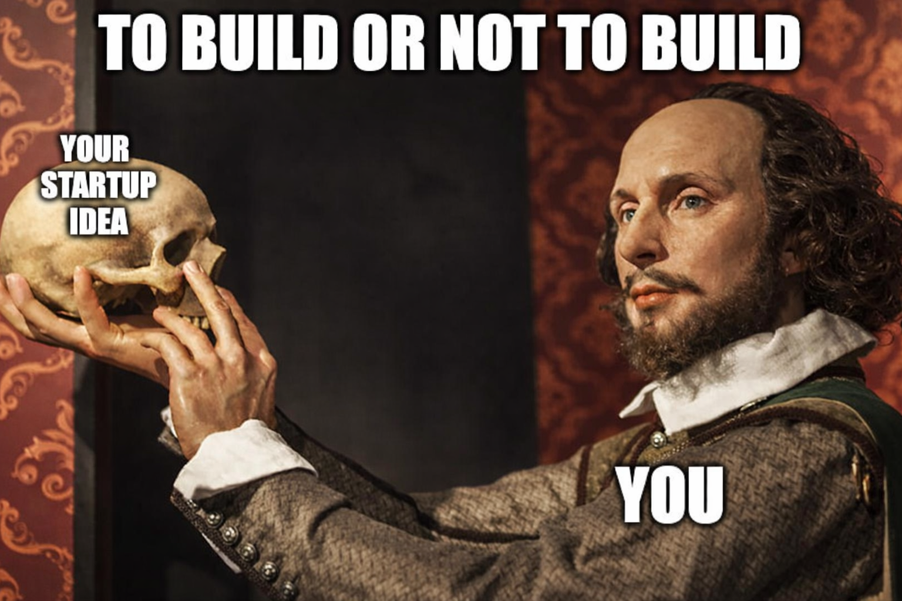

<div align="center">



# App Idea Validation Agent
### *To Build or Not to Build — that is the question this answers.*

**Stop guessing. Start validating.**

AI agents that act as your personal venture analyst — from startup idea brainstorming to full validation and go-to-market strategy. Built for indie developers who'd rather validate in a weekend than regret in six months. Powered by Claude Code, OpenAI Codex, and Cursor.

[](https://github.com/MaxKmet/idea-validation-agents)


[](LICENSE)

</div>

---

Clone the repo. Open it in your AI tool. Start talking. No setup, no API keys, no commands.

---

## Who It's For

- **Indie app developers** who want to validate ideas before building
- **Solo founders** exploring B2C startup ideas and looking for a data-driven brainstorming partner
- **Side-project builders** deciding where to invest their limited time
- **Aspiring developers** with no idea yet who want to discover one worth building
- **Anyone** tired of building things nobody wants

---

## 🚀 Quickstart

No installation. No dependencies. No terminal commands. Just clone and go.

### Claude Code

1. Clone this repository
```bash
git clone https://github.com/MaxKmet/idea-validation-agents.git
```
2. Open [Claude Code](https://claude.ai/code) and open the project folder
3. Start a new chat and say anything — e.g., `"I want to build a habit tracker for climbers. Is it worth it?"`
4. The agent activates automatically from `CLAUDE.md` and starts the right workflow

### OpenAI Codex CLI

1. Clone this repository
```bash
git clone https://github.com/MaxKmet/idea-validation-agents.git
```
2. Install [Codex CLI](https://github.com/openai/codex) if you haven't yet
```bash
npm install -g @openai/codex
```
3. Navigate to the project folder and run Codex
```bash
cd idea-validation-agents
codex
```
4. Say what you want — e.g., `"Help me find an app idea"`. The agent reads `AGENTS.md` and routes you automatically.

### Cursor

1. Clone this repository
```bash
git clone https://github.com/MaxKmet/idea-validation-agents.git
```
2. Open the folder in [Cursor](https://cursor.com)
3. Open the AI chat (Cmd+L / Ctrl+L) and describe your situation  
   Example: `"I'm a solo developer with 3 years experience. Help me validate an idea for climbers — a habit tracker with daily streaks and tips."`
4. The agent reads from `.cursor/rules/` and activates automatically

> **That's it.** The agent detects your intent and routes you to the right workflow. All analysis results are saved to the `memory/` folder so nothing is lost between sessions.

---

## Workflows — 4 Ways to Use the Agent

### 💡 Idea Generation — *"I don't know what to build"* · `~10–15 min`

The agent interviews you about your background, skills, and interests — then researches what's actually trending — and generates 7–10 scored app ideas matched specifically to you.

```
I don't have an app idea yet. Help me find one.
What should I build? I'm a fitness coach with 8k Instagram followers.
I want to find an app idea in the productivity space.
```

**Steps:** background interview → builder profile → trend analysis → idea generation → scoring

**Methodology:** Trend signals are pulled from TikTok Creative Center (hashtag velocity), Reddit (community pain language), App Store (new entrants + review patterns), and Google Trends (search demand). Ideas are filtered against your domain expertise, skills, and distribution advantages from the interview — so you get ideas you can actually build and sell.

**Output:** Ranked + scored list of app ideas saved to `memory/ideas/`

> Don't want to answer questions? Say **"browse topics"** to pick from 20 product domains, or **"skip"** to jump straight to ideas.

---

### 🔍 Idea Validation — *"Is my idea worth building?"* · `~10–15 min`

Full 9-step validation. Every dimension scored, weighted, and combined into a final verdict — with the single riskiest assumption identified and a concrete experiment to test it before writing any code.

```
Validate my idea: an AI tool that rewrites your emails to sound more professional.
I want to build a habit tracker for intermittent fasting. Worth it?
Score this — a subscription app that sends meal plans based on your grocery budget.
```

**Steps:** trend analysis → competitor mapping → desire scoring → pricing model → distribution analysis → retention prediction → CAC modeling → final score (0–100) → decision memo

**Methodology:**
- **Scoring** uses a multiplicative-floor algorithm — one catastrophic weakness kills the overall score, just like in a real startup
- **Pricing** is estimated via Van Westendorp price sensitivity analysis + desire-premium multipliers (e.g. survival/status desires command 1.3–2× price premium)
- **Distribution** models viral coefficient (k-factor) across 6 loop types, ASO opportunity via a 5-factor rubric, and creator economy fit
- **Competitors** are analyzed via systematic App Store search + 1-star/3-star review mining to surface the exact gaps incumbents leave open
- **Riskiest Assumption Test (RAT)** designs a ≤2-week, ≤$100 behavioral experiment to validate the single assumption most likely to kill the idea
- **Pre-mortem** (Klein, 2007) imagines the idea failing in 12 months and traces the most probable causes back to scored weaknesses

**Output:** `decision_memo.md` — verdict (pursue / test / pivot / drop), strengths, risks, RAT experiment, kill criteria, and your next step

---

### 📊 Market Deep Dive — *"Tell me about this market"* · `~10–15 min`

Research a category before committing to any idea. Understand who already owns it, what users hate, and whether the timing is right.

```
Tell me about the journaling app market.
What's happening in the AI language learning space?
Is the meditation app market still worth entering?
```

**Steps:** multi-platform trend analysis → competitor landscape → market size (TAM/SAM/SOM) → distribution channel assessment

**Methodology:**
- Trend velocity scored across platforms: rising-fast / rising / stable / declining
- Market saturation rated via a 5-factor rubric (competitor count, incumbent dominance, funding activity, keyword saturation, content saturation)
- Market size uses triangulated bottom-up estimation: search volume × intent conversion rate, community size × platform multiplier, and competitor revenue proxies — cross-checked for consistency
- SOM estimates use indie-realistic capture rate benchmarks by app category (e.g. niche productivity: 0.5–2.0% year 1)

**Output:** Trend intelligence + competitor map + TAM/SAM/SOM estimates saved to `memory/market_insights/`

---

### 🔄 Pivot Optimization — *"My idea scored low. Now what?"* · `~10–15 min`

Finds the best version of a failing idea instead of abandoning it entirely. Each pivot option changes exactly 1–2 variables — audience, niche, pricing model, or feature emphasis — with a projected score improvement before you commit.

```
My idea scored 34/100. Should I pivot?
The validation said to pivot. What are my best options?
This isn't working — what should I change about my fitness app idea?
```

**Steps:** re-read scores → weakness root cause analysis → 2–3 pivot options with projected scores → re-score best option

**Methodology:**
- Weaknesses are classified by root cause: structural (can't fix), situational (fixable with time/budget), knowledge-gap (needs more research), or addressable (clear fix exists) — only the latter two generate pivot options
- Each pivot must pass the **Same Idea Test**: changes 1–2 variables, preserves at least one strong dimension, and has evidence from market_insights or competitor review mining
- Scoring simulation projects how each dimension shifts before full re-scoring
- Effort is estimated and adjusted for founder tier — what's "medium" for a builder is "high" for a beginner

**Output:** `pivot_options.json` with ranked pivots, effort estimates, and projected score ranges

---

## What Gets Saved

All outputs persist in `memory/` between sessions.

```
memory/
├── user_profile.md                   ← your builder profile (reused across sessions)
├── market_insights/
│   └── fitness-tiktok-2026-04.md     ← trend data per niche + platform
└── ideas/
    └── habit-tracker-climbers/
        ├── competitors.json
        ├── pricing.json
        ├── scores.json
        └── decision_memo.md          ← the final verdict
```

---

<div align="center">

**[⭐ Star this repo](https://github.com/MaxKmet/idea-validation-agents)** — helps other indie developers find it.

*Validate in a weekend. Build with confidence.*

</div>
